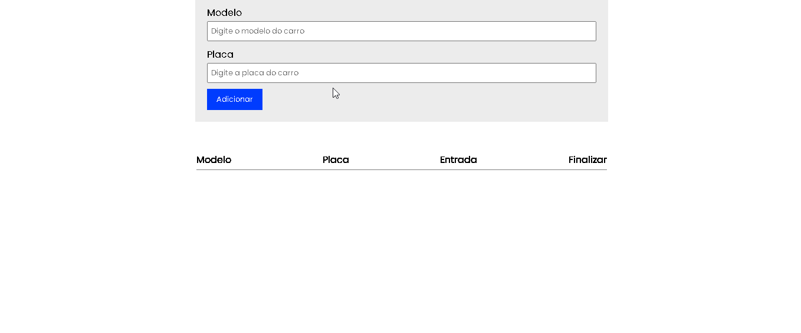

# Sistema de Estacionamento

Sistema simples para estacionamento utilizando o navegador e armazenando os dados no localStorage, registrando modelo, placa e horário de entrada do veículo.

## 💻 Tecnologias usadas:
- HTML 5
- Sass
- JavaScript